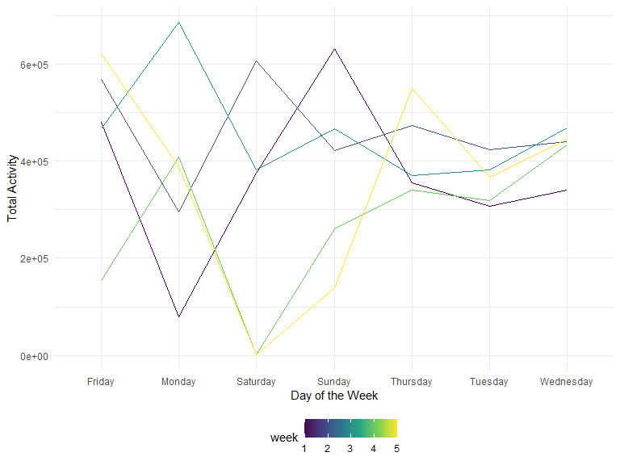

Homework 3
================
Riya Bhilegaonkar
2022-10-11

Load Libraries and Set Chunk Options:

``` r
library(tidyverse)
```

    ## ── Attaching packages ─────────────────────────────────────── tidyverse 1.3.2 ──
    ## ✔ ggplot2 3.3.6      ✔ purrr   0.3.4 
    ## ✔ tibble  3.1.8      ✔ dplyr   1.0.10
    ## ✔ tidyr   1.2.0      ✔ stringr 1.4.1 
    ## ✔ readr   2.1.2      ✔ forcats 0.5.2 
    ## ── Conflicts ────────────────────────────────────────── tidyverse_conflicts() ──
    ## ✖ dplyr::filter() masks stats::filter()
    ## ✖ dplyr::lag()    masks stats::lag()

``` r
library(p8105.datasets)
library(patchwork)

knitr::opts_chunk$set(
    echo = TRUE,
    warning = FALSE,
    fig.width = 8, 
  fig.height = 6,
  out.width = "90%"
)

theme_set(theme_minimal() + theme(legend.position = "bottom"))

options(
  ggplot2.continuous.colour = "viridis",
  ggplot2.continuous.fill = "viridis"
)

scale_colour_discrete = scale_colour_viridis_d
scale_fill_discrete = scale_fill_viridis_d
```

## Problem 1

``` r
data("instacart")
View("instacart")
```

The dataset contains 1,384,617 observations of 131,209 unique users,
where each row in the dataset is a product from an order.

## Problem 2

Loading and tidying the data

``` r
accel_data = read_csv("data/accel_data.csv")%>% janitor::clean_names() %>%
mutate(day_type = ifelse(day == "Saturday" | day == "Sunday", "weekend", "weekday")) %>% 
drop_na() %>%
pivot_longer(activity_1:activity_1440, names_to = "activity", values_to="min_time")
```

    ## Rows: 35 Columns: 1443
    ## ── Column specification ────────────────────────────────────────────────────────
    ## Delimiter: ","
    ## chr    (1): day
    ## dbl (1442): week, day_id, activity.1, activity.2, activity.3, activity.4, ac...
    ## 
    ## ℹ Use `spec()` to retrieve the full column specification for this data.
    ## ℹ Specify the column types or set `show_col_types = FALSE` to quiet this message.

``` r
View(accel_data)
```

The `accel_data` dataset has data from an accelerometer of a 63 year old
male with a BMI of 25 who was diagnosed with congestive heart failure.
The resulting dataset has the 5 variables of week, day_id, day, day_type
(weekday vs weekend), activity, min_time (activity count for each minute
of a 24-hour day starting at midnight). There are 50400 observations and
5 variables. The dataset provides specific information on the
accelerometer activity count for each minute for a particular, week, day
and specific day_id, indicating distinctive days.

Aggregate across minutes to create a total activity variable for each
day, and create a table showing these totals. Are any trends apparent?

``` r
accel_data %>% 
pivot_wider(names_from="activity",values_from ="min_time") %>%
group_by(week, day_id, day) %>% summarise(tot_activity = rowSums(across(activity_1:activity_1440,na.rm=TRUE))) %>%
knitr::kable(digits = 2)
```

    ## `summarise()` has grouped output by 'week', 'day_id'. You can override using
    ## the `.groups` argument.

| week | day_id | day       | tot_activity |
|-----:|-------:|:----------|-------------:|
|    1 |      1 | Friday    |    480542.62 |
|    1 |      2 | Monday    |     78828.07 |
|    1 |      3 | Saturday  |    376254.00 |
|    1 |      4 | Sunday    |    631105.00 |
|    1 |      5 | Thursday  |    355923.64 |
|    1 |      6 | Tuesday   |    307094.24 |
|    1 |      7 | Wednesday |    340115.01 |
|    2 |      8 | Friday    |    568839.00 |
|    2 |      9 | Monday    |    295431.00 |
|    2 |     10 | Saturday  |    607175.00 |
|    2 |     11 | Sunday    |    422018.00 |
|    2 |     12 | Thursday  |    474048.00 |
|    2 |     13 | Tuesday   |    423245.00 |
|    2 |     14 | Wednesday |    440962.00 |
|    3 |     15 | Friday    |    467420.00 |
|    3 |     16 | Monday    |    685910.00 |
|    3 |     17 | Saturday  |    382928.00 |
|    3 |     18 | Sunday    |    467052.00 |
|    3 |     19 | Thursday  |    371230.00 |
|    3 |     20 | Tuesday   |    381507.00 |
|    3 |     21 | Wednesday |    468869.00 |
|    4 |     22 | Friday    |    154049.00 |
|    4 |     23 | Monday    |    409450.00 |
|    4 |     24 | Saturday  |      1440.00 |
|    4 |     25 | Sunday    |    260617.00 |
|    4 |     26 | Thursday  |    340291.00 |
|    4 |     27 | Tuesday   |    319568.00 |
|    4 |     28 | Wednesday |    434460.00 |
|    5 |     29 | Friday    |    620860.00 |
|    5 |     30 | Monday    |    389080.00 |
|    5 |     31 | Saturday  |      1440.00 |
|    5 |     32 | Sunday    |    138421.00 |
|    5 |     33 | Thursday  |    549658.00 |
|    5 |     34 | Tuesday   |    367824.00 |
|    5 |     35 | Wednesday |    445366.00 |

From the table there does not appear to be any obvious trends.

Making a single-panel plot that shows the 24-hour activity time course
for each day

``` r
accel_data %>%
pivot_wider(names_from="activity",values_from ="min_time") %>%
group_by(week, day_id, day) %>% summarise(tot_activity = rowSums(across(activity_1:activity_1440,na.rm=TRUE))) %>%
ggplot(aes(x=day, y=tot_activity,group=week, color=week)) +
geom_line() +
ylab("Total Activity")+
xlab("Day of the Week")
```

    ## `summarise()` has grouped output by 'week', 'day_id'. You can override using
    ## the `.groups` argument.



## Problem 3

Loading the data

``` r
ny_noaa = get(data("ny_noaa")) %>%
janitor::clean_names() %>% view
```
