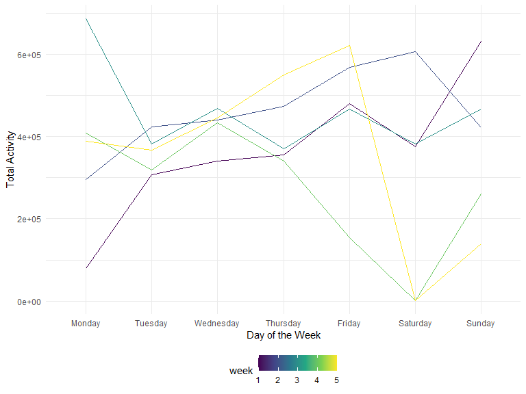
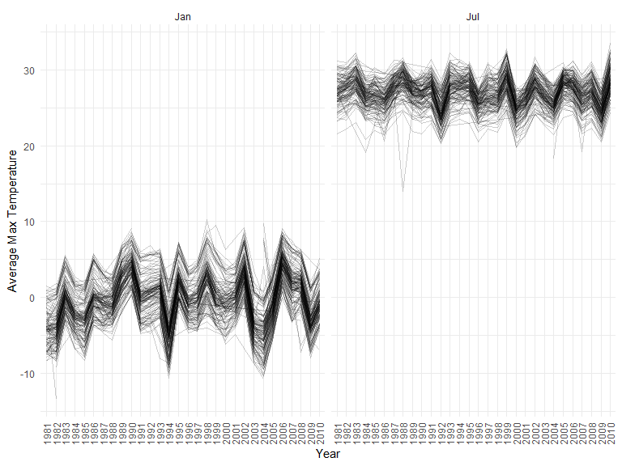
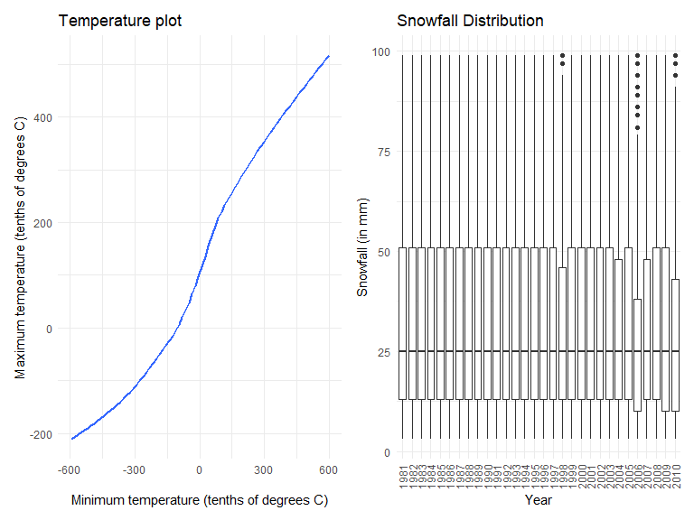

Homework 3
================
Riya Bhilegaonkar
2022-10-11

Load Libraries and Set Chunk Options:

``` r
library(tidyverse)
```

    ## ── Attaching packages ─────────────────────────────────────── tidyverse 1.3.2 ──
    ## ✔ ggplot2 3.3.6      ✔ purrr   0.3.4 
    ## ✔ tibble  3.1.8      ✔ dplyr   1.0.10
    ## ✔ tidyr   1.2.0      ✔ stringr 1.4.1 
    ## ✔ readr   2.1.2      ✔ forcats 0.5.2 
    ## ── Conflicts ────────────────────────────────────────── tidyverse_conflicts() ──
    ## ✖ dplyr::filter() masks stats::filter()
    ## ✖ dplyr::lag()    masks stats::lag()

``` r
library(p8105.datasets)
library(patchwork)

knitr::opts_chunk$set(
    echo = TRUE,
    warning = FALSE,
    fig.width = 8, 
  fig.height = 6,
  out.width = "90%"
)

theme_set(theme_minimal() + theme(legend.position = "bottom"))

options(
  ggplot2.continuous.colour = "viridis",
  ggplot2.continuous.fill = "viridis"
)

scale_colour_discrete = scale_colour_viridis_d
scale_fill_discrete = scale_fill_viridis_d
```

## Problem 1

The dataset contains 1,384,617 observations of 131,209 unique users,
where each row in the dataset is a product from an order.

``` r
data("instacart")

instacart = 
  instacart %>% 
  as_tibble(instacart)
```

#### Answer questions about the data

This dataset contains 1384617 rows and 15 columns, with each row
resprenting a single product from an instacart order. Variables include
identifiers for user, order, and product; the order in which each
product was added to the cart. There are several order-level variables,
describing the day and time of the order, and number of days since prior
order. Then there are several item-specific variables, describing the
product name (e.g. Yogurt, Avocado), department (e.g. dairy and eggs,
produce), and aisle (e.g. yogurt, fresh fruits), and whether the item
has been ordered by this user in the past. In total, there are 39123
products found in 131209 orders from 131209 distinct users.

Below is a table summarizing the number of items ordered from aisle. In
total, there are 134 aisles, with fresh vegetables and fresh fruits
holding the most items ordered by far.

``` r
instacart %>% 
  count(aisle) %>% 
  arrange(desc(n))
```

    ## # A tibble: 134 × 2
    ##    aisle                              n
    ##    <chr>                          <int>
    ##  1 fresh vegetables              150609
    ##  2 fresh fruits                  150473
    ##  3 packaged vegetables fruits     78493
    ##  4 yogurt                         55240
    ##  5 packaged cheese                41699
    ##  6 water seltzer sparkling water  36617
    ##  7 milk                           32644
    ##  8 chips pretzels                 31269
    ##  9 soy lactosefree                26240
    ## 10 bread                          23635
    ## # … with 124 more rows

This plot shows the number of items ordered in each aisle. Here, aisles
are ordered by ascending number of items.

``` r
instacart %>% 
  count(aisle) %>% 
  filter(n > 10000) %>% 
  mutate(aisle = fct_reorder(aisle, n)) %>% 
  ggplot(aes(x = aisle, y = n)) + 
  geom_point() + 
  labs(title = "Number of items ordered in each aisle") +
  theme(axis.text.x = element_text(angle = 60, hjust = 1))
```


The table shows the three most popular items in aisles
`baking ingredients`, `dog food care`, and `packaged vegetables fruits`,
and includes the number of times each item is ordered in your table.

``` r
instacart %>% 
  filter(aisle %in% c("baking ingredients", "dog food care", "packaged vegetables fruits")) %>%
  group_by(aisle) %>% 
  count(product_name) %>% 
  mutate(rank = min_rank(desc(n))) %>% 
  filter(rank < 4) %>% 
  arrange(desc(n)) %>%
  knitr::kable()
```

| aisle                      | product_name                                  |    n | rank |
|:---------------------------|:----------------------------------------------|-----:|-----:|
| packaged vegetables fruits | Organic Baby Spinach                          | 9784 |    1 |
| packaged vegetables fruits | Organic Raspberries                           | 5546 |    2 |
| packaged vegetables fruits | Organic Blueberries                           | 4966 |    3 |
| baking ingredients         | Light Brown Sugar                             |  499 |    1 |
| baking ingredients         | Pure Baking Soda                              |  387 |    2 |
| baking ingredients         | Cane Sugar                                    |  336 |    3 |
| dog food care              | Snack Sticks Chicken & Rice Recipe Dog Treats |   30 |    1 |
| dog food care              | Organix Chicken & Brown Rice Recipe           |   28 |    2 |
| dog food care              | Small Dog Biscuits                            |   26 |    3 |

The table showing the mean hour of the day at which Pink Lady Apples and
Coffee Ice Cream are ordered on each day of the week.

``` r
instacart %>%
  filter(product_name %in% c("Pink Lady Apples", "Coffee Ice Cream")) %>%
  group_by(product_name, order_dow) %>%
  summarize(mean_hour = mean(order_hour_of_day)) %>%
  spread(key = order_dow, value = mean_hour) %>%
  knitr::kable(digits = 2)
```

    ## `summarise()` has grouped output by 'product_name'. You can override using the
    ## `.groups` argument.

| product_name     |     0 |     1 |     2 |     3 |     4 |     5 |     6 |
|:-----------------|------:|------:|------:|------:|------:|------:|------:|
| Coffee Ice Cream | 13.77 | 14.32 | 15.38 | 15.32 | 15.22 | 12.26 | 13.83 |
| Pink Lady Apples | 13.44 | 11.36 | 11.70 | 14.25 | 11.55 | 12.78 | 11.94 |

## Problem 2

Loading and tidying the data

``` r
accel_data = read_csv("data/accel_data.csv")%>% janitor::clean_names() %>%
mutate(day_type = ifelse(day == "Saturday" | day == "Sunday", "weekend", "weekday")) %>% 
drop_na() %>%
pivot_longer(activity_1:activity_1440, names_to = "activity", values_to="min_time")
```

    ## Rows: 35 Columns: 1443
    ## ── Column specification ────────────────────────────────────────────────────────
    ## Delimiter: ","
    ## chr    (1): day
    ## dbl (1442): week, day_id, activity.1, activity.2, activity.3, activity.4, ac...
    ## 
    ## ℹ Use `spec()` to retrieve the full column specification for this data.
    ## ℹ Specify the column types or set `show_col_types = FALSE` to quiet this message.

The `accel_data` dataset has data from an accelerometer of a 63 year old
male with a BMI of 25 who was diagnosed with congestive heart failure.
The resulting dataset has the 5 variables of week, day_id, day, day_type
(weekday vs weekend), activity, min_time (activity count for each minute
of a 24-hour day starting at midnight). There are 50400 observations and
5 variables. The dataset provides specific information on the
accelerometer activity count for each minute for a particular, week, day
and specific day_id, indicating distinctive days.

Aggregate across minutes to create a total activity variable for each
day, and create a table showing these totals. Are any trends apparent?

``` r
accel_data %>% 
pivot_wider(names_from="activity",values_from ="min_time") %>%
group_by(week, day_id, day) %>% summarise(tot_activity = rowSums(across(activity_1:activity_1440,na.rm=TRUE))) %>%
knitr::kable(digits = 2)
```

    ## `summarise()` has grouped output by 'week', 'day_id'. You can override using
    ## the `.groups` argument.

| week | day_id | day       | tot_activity |
|-----:|-------:|:----------|-------------:|
|    1 |      1 | Friday    |    480542.62 |
|    1 |      2 | Monday    |     78828.07 |
|    1 |      3 | Saturday  |    376254.00 |
|    1 |      4 | Sunday    |    631105.00 |
|    1 |      5 | Thursday  |    355923.64 |
|    1 |      6 | Tuesday   |    307094.24 |
|    1 |      7 | Wednesday |    340115.01 |
|    2 |      8 | Friday    |    568839.00 |
|    2 |      9 | Monday    |    295431.00 |
|    2 |     10 | Saturday  |    607175.00 |
|    2 |     11 | Sunday    |    422018.00 |
|    2 |     12 | Thursday  |    474048.00 |
|    2 |     13 | Tuesday   |    423245.00 |
|    2 |     14 | Wednesday |    440962.00 |
|    3 |     15 | Friday    |    467420.00 |
|    3 |     16 | Monday    |    685910.00 |
|    3 |     17 | Saturday  |    382928.00 |
|    3 |     18 | Sunday    |    467052.00 |
|    3 |     19 | Thursday  |    371230.00 |
|    3 |     20 | Tuesday   |    381507.00 |
|    3 |     21 | Wednesday |    468869.00 |
|    4 |     22 | Friday    |    154049.00 |
|    4 |     23 | Monday    |    409450.00 |
|    4 |     24 | Saturday  |      1440.00 |
|    4 |     25 | Sunday    |    260617.00 |
|    4 |     26 | Thursday  |    340291.00 |
|    4 |     27 | Tuesday   |    319568.00 |
|    4 |     28 | Wednesday |    434460.00 |
|    5 |     29 | Friday    |    620860.00 |
|    5 |     30 | Monday    |    389080.00 |
|    5 |     31 | Saturday  |      1440.00 |
|    5 |     32 | Sunday    |    138421.00 |
|    5 |     33 | Thursday  |    549658.00 |
|    5 |     34 | Tuesday   |    367824.00 |
|    5 |     35 | Wednesday |    445366.00 |

From the table there does not appear to be any obvious trends. However,
there do appear to be 2 Saturdays, one during the 4th week and one
during the 5th week where the total activity minutes are low in relation
to the other days of the week.

Making a single-panel plot that shows the 24-hour activity time course
for each day

``` r
accel_data %>%
pivot_wider(names_from="activity",values_from ="min_time") %>%
group_by(week, day_id, day) %>% summarise(tot_activity = rowSums(across(activity_1:activity_1440,na.rm=TRUE))) %>%
ggplot(aes(x=factor(day,levels = c("Monday", "Tuesday", "Wednesday", "Thursday", "Friday", "Saturday", "Sunday")), y=tot_activity,group=week, color=week)) +
geom_line() +
ylab("Total Activity")+
xlab("Day of the Week")
```

    ## `summarise()` has grouped output by 'week', 'day_id'. You can override using
    ## the `.groups` argument.



From the plot we see that there is fluctuation in the total activity
minute counts as the days progress each week, we do see a dip in
activity time during week 4 and 5 on Saturday. Actvity counts tend to
rise from Tuesday to Saturday. There does appear to be variance in the
fluctuations per week and hence we can’t conclude any obvious patterns.

## Problem 3

The NY NOAA dataset contains records of precipation, snowfall, maximum
temperature, minimum temperature and snow depth for different stations.
There is the issue of missing data as only half the stations report
precipitation only and the period of records vary my station. This is an
extensive issue as some stations may only present data for a year versus
some may report data for over 175 years. The dataset has 2595176
observations and 7 variables, key variables are `id` which is Weather
station ID and `date`, these group together the weather mertic data that
the other 5 variables represent.

Loading the data and cleaning up the data.

``` r
data("ny_noaa")

ny_noaa =
  ny_noaa %>%
  as_tibble(ny_noaa) %>%
  janitor::clean_names() %>%
  separate(date, c("year", "month", "day"))%>%
  mutate(tmax = as.integer(tmax), tmin = as.integer(tmin), snow = as.integer(snow)) %>%
  mutate(real_tmax= tmax/10, real_tmin=tmin/10, real_prcp = prcp/10, real_snow = snow/25.4, "month" = as.integer(month), "month" = month.abb[month])
```

To ensure observations for temperature, precipitation and snowfall are
given in reasonable units we perform some transformations. In the case
of precipitation values, we find the real values by ten to convert to mm
and celcius. Snowfall is typically discussed in inches, hence we divide
snow by 25.4 to obtain column `real_snow` that represents snowfall in
inches. `real_tmax` and `real_tmin` represent temperature in celcius and
`real_prcp` has precipitation in mm.

``` r
ny_noaa %>% 
count(snow) %>%
mutate(rank=min_rank(desc(n)))%>%
filter(rank < 4)%>%
arrange(desc(n))%>%
knitr::kable()
```

| snow |       n | rank |
|-----:|--------:|-----:|
|    0 | 2008508 |    1 |
|   NA |  381221 |    2 |
|   25 |   31022 |    3 |

The most commonly observed value is 0, this as snowfall is measured in
terms of mm and it is only common to see snow in the winter months of
New York which typically range from December to March. As this is only 4
months of the year, the majority of days would have 0 mm of snowfall.
Other common values are NA, likely due to a large number of stations
only measuring precipitation. The 3rd most common value is 25 mm of
snowfall, observed 31022 times in the dataset.

Two-panel plot showing the average max temperature in January and in
July in each station across years.

``` r
ny_noaa %>%
filter(month == "Jan"| month == "Jul") %>% 
group_by(month, year, id) %>% 
summarize(mean_tmax = mean(real_tmax, na.rm = TRUE)) %>% 
ggplot(aes(x = year, y = mean_tmax, group=id)) +
geom_line(alpha=.2) +
facet_grid(.~month) + 
theme(axis.text.x = element_text(angle = 90, vjust = 0.5, hjust=1))+
ylab("Average Max Temperature")+
xlab("Year")
```

    ## `summarise()` has grouped output by 'month', 'year'. You can override using the
    ## `.groups` argument.



For the two panel plot we use the created variable of `real_tmax` which
converts the units of temperature from tenths of celcius to celcius for
appropriate interpretation. From the two panel plot we see that
temperatures in January fluctuate between -10 degrees celcius and 10
degrees celcius, there does appear to some outliers such as a
temperature that is below -10 in the year of 1982. There are
fluctuations of average temperatures at the various stations, but the
avergae temperatures are consistent with what is expected to be a
temperature in new york in January. Now considering the July panel, we
see that temperatures are typically above 20 degrees celcius, though
there are some noticeable outliers such as in the year of 1988,
temperatures in July seem to fluctuate at a smaller frequency than the
temperatures in January.

Make a two-panel plot showing (i) `tmax` vs `tmin` for the full dataset
and (ii) make a plot showing the distribution of snowfall values greater
than 0 and less than 100 separately by year.

``` r
temp_plot = ny_noaa %>%
ggplot(aes(x=tmin, y=tmax))+
geom_smooth(se = FALSE)+
labs(
    title = "Temperature plot",
    x = "Minimum temperature (tenths of degrees C)",
    y = "Maximum temperature (tenths of degrees C)"
  )

snow_dist = ny_noaa %>%
  filter((snow > 0 & snow < 100))%>%
  ggplot(aes(x=year, y=snow))+
  geom_boxplot()+ 
  theme(axis.text.x = element_text(angle = 90, vjust = 0.5, hjust=1))+
  labs(
    title = "Snowfall Distribution",
    x = "Year",
    y = "Snowfall (in mm)"
  )

temp_plot + snow_dist
```

    ## `geom_smooth()` using method = 'gam' and formula 'y ~ s(x, bs = "cs")'


